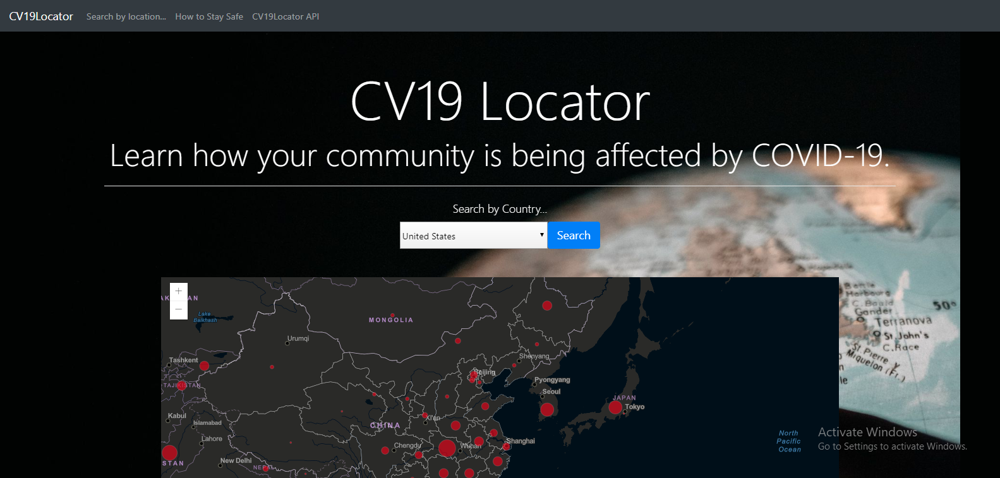
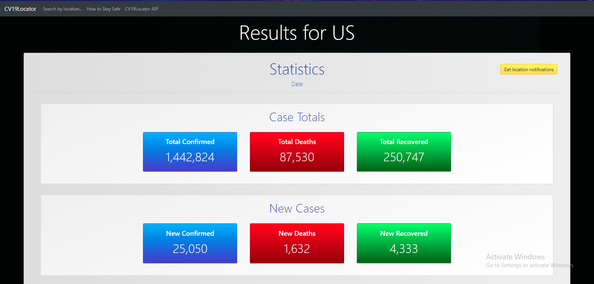
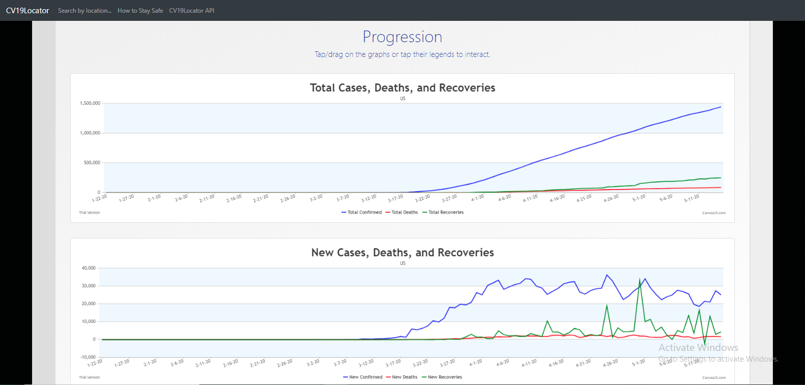
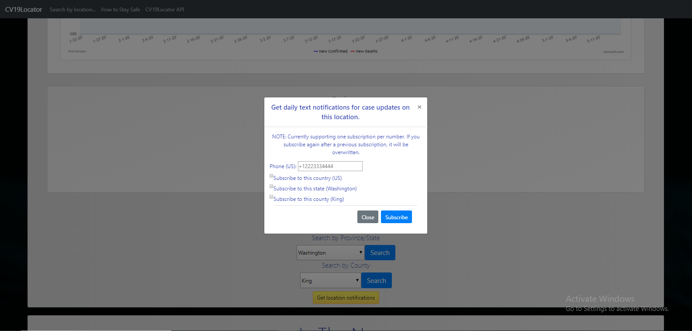

# COVID-19 Locator

(work in progress)

Deployed at: http://www.cv19location.com (currently in alpha)

This Web-based application utilizes SpringMVC and RESTful web services to provide a user with current case 
information on how COVID-19 is impacting their community in the United States. Raw case information (total confirmed/deaths/recovered cases) 
is rendered directly from Johns Hopkins University CSSE .csv files sourced on GitHub. Users can browse for a location to see case data visualized in graphs and tables. Users
may also subscribe to SMS to receive daily updates on new case information for their selected location. 

## Run the app
Visit the website at: http://www.cv19location.com (currently in alpha)

Or if you'd like to run it from your local machine: 
- Install IntelliJ IDEA. 
- Clone this repository into your local machine through the terminal command 'git clone https://github.com/svakam/covid-19-location.git'. 
- Open IntelliJ IDEA. 
- Choose the 'Import project' option, locate the project folder through the file explorer, and import this project. 
- Wait for the project to build. 
- Run the app with the green Play button, either located at the bottom left of the IDE or top right. 
- Open a browser session, and in the URL text box, type 'localhost:8080' and enter. 

## Screenshots

## Project management
Trello: https://trello.com/b/LuJDmF4r/covid-19

## Languages and Technologies Used
- Languages
  - Java, JavaScript, HTML/CSS
- Technologies
  - IDE: IntelliJ IDEA
  - Frameworks: SpringMVC, Spring Boot, Thymeleaf
  - APIs: CV19Locator API, Postman
  - Libraries: CanvasJS, Bootstrap, GSON, jQuery
  - AWS: DynamoDB, SNS, Elastic Beanstalk, Route 53
  
## Contact
If you're interested in contributing, or have questions regarding the CV19Locator API, drop an email at svakam6370@gmail.com or DM me on LinkedIn at linkedin.com/in/svakam. 

## JHU Data Changes
- NOTE: As of 03/25/2020, for JHU CSSE's _county-level_ information for the United States, there is no data available between and including 03/10/2020 and 03/22/2020. In addition,
there are a number of redundancies in countries names, associated slugs, and state/province names. This spreadsheet outlines the issues being addressed (and hopefully corrected for)
imminently: https://docs.google.com/spreadsheets/d/19x2CUBdHPlxBKUtfgJU2LzVXR_piVtvlo8lgi_DictI/edit?usp=sharing

- NOTE: As of 03/28/2020, JHU CSSE .csv data appears to have been re-standardized and more developer-approachable for parsing.

- NOTE: As of 04/15/2020, I've noticed an errata.csv file in JHU CSSE. I'm looking into this. 

- NOTE: As of 05/01/2020, errata.csv is already accounted for in the data. 

## Acknowledgements
### Contributors (thank you!)
- Ellen Conley
- (hopefully a few more?)

### Sources
AWS:
- SNS
  - Java setup: https://docs.aws.amazon.com/sdk-for-java/v2/developer-guide/setup-project-gradle.html
  - Topic: https://docs.aws.amazon.com/sns/latest/dg/sns-tutorial-create-topic.html
  - Subscription to endpoint: https://docs.aws.amazon.com/sns/latest/dg/sns-tutorial-create-subscribe-endpoint-to-topic.html
  - Publish message to topic: https://docs.aws.amazon.com/sns/latest/dg/sns-tutorial-publish-message-to-topic.html
  - PublishRequest: https://docs.aws.amazon.com/AWSJavaSDK/latest/javadoc/com/amazonaws/services/sns/model/PublishRequest.html
- Credentials: https://github.com/aws/aws-toolkit-jetbrains/issues/718 https://docs.aws.amazon.com/sdk-for-java/v2/developer-guide/credentials.html
- Elastic Beanstalk
- Credentials in EC2: https://docs.aws.amazon.com/sdk-for-php/v3/developer-guide/guide_credentials_environment.html https://alexdisler.com/2016/03/26/nodejs-environment-variables-elastic-beanstalk-aws/
- Route 53: https://docs.aws.amazon.com/Route53/latest/DeveloperGuide/Welcome.html
- Logging AWS SDK for Java Calls: https://docs.aws.amazon.com/sdk-for-java/v2/developer-guide/java-dg-logging.html

COVID-19 APIs and COVID-19 data consulted:
- Johns Hopkins CSSE: https://github.com/CSSEGISandData/COVID-19 https://systems.jhu.edu/research/public-health/2019-ncov-map-faqs/ https://www.arcgis.com/apps/opsdashboard/index.html#/bda7594740fd40299423467b48e9ecf6
- CDC: https://open.cdc.gov/apis.html
- Kyle Redelinghuys, who created the [Covid19API](https://covid19api.com/#details)
- USAFacts: https://usafacts.org/visualizations/coronavirus-covid-19-spread-map/
- Some state/local health department websites

Baeldung:
- HTTP Request in Java: https://www.baeldung.com/java-http-request
- Thymeleaf: https://www.baeldung.com/thymeleaf-in-spring-mvc
- Path variables: https://www.baeldung.com/spring-thymeleaf-path-variables
- GSON Deserialization: https://www.baeldung.com/gson-deserialization-guide
- URLEncoder: https://www.baeldung.com/java-url-encoding-decoding

Bootstrap: 
- Docs: https://getbootstrap.com/docs/4.4/getting-started/introduction/

CanvasJS:
- Docs: https://canvasjs.com/docs/charts/basics-of-creating-html5-chart/
- Date/time: https://canvasjs.com/docs/charts/basics-of-creating-html5-chart/formatting-date-time/ https://canvasjs.com/forums/topic/date-time-formatting-issues/ 
https://jsfiddle.net/canvasjs/6ftyg155/

Deployment: 
- Heroku vs AWS: https://www.guru99.com/heroku-vs-aws.html
- CNAME and Domain Names: https://www.freecodecamp.org/news/why-cant-a-domain-s-root-be-a-cname-8cbab38e5f5c/
- AWS Route 53: https://docs.aws.amazon.com/Route53/latest/DeveloperGuide/dns-configuring.html
- Routing Traffic to an AWS Elastic Beanstalk Environment: https://docs.aws.amazon.com/Route53/latest/DeveloperGuide/routing-to-
beanstalk-environment.html#routing-to-beanstalk-environment-create-alias-procedure

GSON: 
- GitHub: https://github.com/google/gson/blob/master/UserGuide.md 
- BEGIN_ARRAY vs. BEGIN_OBJECT: https://futurestud.io/tutorials/gson-mapping-of-arrays-and-lists-of-objects

Spring.io:
- REST: https://spring.io/guides/gs/rest-service/
- REST/HTTP: https://spring.io/guides/tutorials/bookmarks/
- REST: https://spring.io/guides/gs/serving-web-content/

Stack Overflow:
- Using Firebase with Spring boot REST application https://stackoverflow.com/questions/39183107/how-to-use-firebase-with-spring-boot-rest-application
- IOException: https://stackoverflow.com/questions/22900477/java-io-exception-stream-closed
- GSON import/build issue: https://stackoverflow.com/questions/47566665/cannot-resolve-symbol-gson-and-it-wont-allow-me-to-import/47566770
- Thymeleaf list iteration: https://stackoverflow.com/questions/38367339/thymeleaf-how-to-loop-a-list-by-index
- Ambiguous handler methods: https://stackoverflow.com/questions/35155916/handling-ambiguous-handler-methods-mapped-in-rest-application-with-spring
- URL Encoding: https://stackoverflow.com/questions/10786042/java-url-encoding-of-query-string-parameters
- @PathVariable vs. @RequestParam in Spring: https://stackoverflow.com/questions/30809302/spring-rest-use-of-pathvariable-and-requestparam 
https://stackoverflow.com/questions/24059773/correct-way-to-pass-multiple-values-for-same-parameter-name-in-get-request
- HTTP Content-Type: https://stackoverflow.com/questions/23714383/what-are-all-the-possible-values-for-http-content-type-header
- HTTP Servlet Request: https://stackoverflow.com/questions/9607903/get-domain-name-from-given-url 
https://stackoverflow.com/questions/1490821/whats-the-best-way-to-get-the-current-url-in-spring-mvc
- Static instantiation block: https://stackoverflow.com/questions/8082469/what-does-static-mean-in-the-java-syntax/8082526
- AWS Builder vs. Class Instances and Private Access: https://stackoverflow.com/questions/60102950/maven-project-amazons3clientbuilder-has-private-access-in-com-amazonaws-servi
- Bootstrap Modal on Page Load: https://stackoverflow.com/questions/10233550/launch-bootstrap-modal-on-page-load
- Auto-scroll to divs: https://stackoverflow.com/questions/18071046/smooth-scroll-to-specific-div-on-click/18071231

Thymeleaf: 
- Layouts: https://www.thymeleaf.org/doc/articles/layouts.html
- Iteration: https://www.baeldung.com/thymeleaf-iteration
- Manual: https://www.thymeleaf.org/doc/tutorials/3.0/usingthymeleaf.html#the-good-thymes-virtual-grocery

Other:
- HTTP: https://www.youtube.com/watch?v=iYM2zFP3Zn0
- HTTP Request Lifecycle: https://dev.to/dangolant/things-i-brushed-up-on-this-week-the-http-request-lifecycle-
- RESTful Practice: http://zetcode.com/springboot/requestparam/ https://www.codebyamir.com/blog/spring-mvc-essentials-requestmapping-pathvariable-annotations 
https://www.baeldung.com/spring-request-param https://apiguide.readthedocs.io/en/latest/build_and_publish/use_RESTful_urls.html
- URL Encoding: https://www.urlencoder.io/learn/ https://docs.oracle.com/javase/7/docs/api/java/net/URLEncoder.html 
https://www.geeksforgeeks.org/java-net-urlencoder-class-java/
- CSV Format: https://www.howtogeek.com/348960/what-is-a-csv-file-and-how-do-i-open-it/
- Parsing and type-casting: https://beginnersbook.com/2019/04/java-char-to-int-conversion/
- Parts of a URL: https://blog.hubspot.com/marketing/parts-url
- Regex & Java: https://www.freeformatter.com/java-regex-tester.html#ad-output 
https://regex101.com/ https://docs.oracle.com/javase/7/docs/api/java/util/regex/Pattern.html https://docs.oracle.com/javase/tutorial/essential/regex/pattern.html
- Inheritance and instantiating superclass declaration as subclass: https://www.codesdope.com/java-subclass/ https://www.geeksforgeeks.org/referencing-subclass-objects-subclass-vs-superclass-reference/
https://docs.oracle.com/javase/tutorial/java/IandI/subclasses.html
- Validating JSON schema: https://www.youtube.com/watch?v=X072eKtOIio
- JS Window Location: https://www.w3schools.com/js/js_window_location.asp
- Free Icons: https://www.flaticon.com/home
- jQuery Animated Number Counter: http://www.i-visionblog.com/2014/11/jquery-animated-number-counter-from-zero-to-value-jquery-animation.html
- Code Fellows Java curriculum
